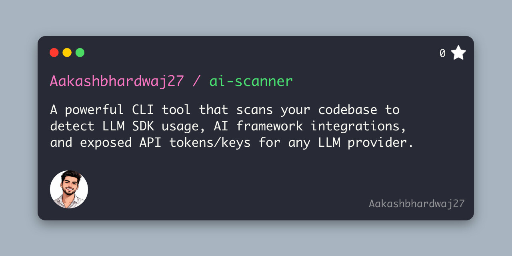

<p align="center">
  
</p>

<h1 align="center">ai-scanner</h1>

<p align="center">
  Scan your codebase for LLM SDK usage, AI frameworks, exposed API tokens, and hardcoded secrets.
</p>

<p align="center">
  <a href="https://github.com/Aakashbhardwaj27/ai-scanner/actions/workflows/ci.yml"></a>
  <a href="https://www.npmjs.com/package/ai-scanner"></a>
  <a href="https://opensource.org/licenses/MIT"></a>
  <a href="https://nodejs.org/"></a>
  
  
  <a href="https://github.com/Aakashbhardwaj27/ai-scanner-mcp"></a>
</p>

A powerful CLI tool that scans your codebase to detect **LLM SDK usage**, **AI framework integrations**, **exposed API tokens**, and **hardcoded secrets** — all in one command.

Zero dependencies. 145 detection patterns. Works with Node.js 18+.



## Features

- **LLM SDK Detection** — OpenAI, Anthropic, Google Gemini, Cohere, Mistral, Groq, Replicate, Together AI, AWS Bedrock, Azure OpenAI, Ollama, LiteLLM, DeepSeek, and more
- **AI Framework Detection** — LangChain, LlamaIndex, Haystack, AutoGen, CrewAI, Vercel AI SDK, DSPy, Semantic Kernel, LangGraph, vLLM, and more
- **AI Token Scanning** — Detects hardcoded keys for OpenAI (`sk-`), Anthropic (`sk-ant-`), Hugging Face (`hf_`), Google (`AIzaSy`), AWS (`AKIA`), Groq (`gsk_`), Replicate (`r8_`), LangSmith (`ls__`), and more
- **Generic Secret Scanning** — Stripe, Twilio, SendGrid, GitHub, GitLab, Slack, Discord, Telegram, database URIs, private keys (RSA/SSH/PGP), JWTs, and 50+ more patterns
- **Smart Filtering** — Ignores `.env` files and filters out SDK/framework mentions in READMEs, docs, and example files
- **MCP Server** — Use with Claude Code, Cursor, and other AI agents via [ai-scanner-mcp](https://github.com/Aakashbhardwaj27/ai-scanner-mcp)
- **Multiple Output Formats** — Rich console output, JSON, and SARIF (for CI/CD)
- **Jupyter Notebook Support** — Parses `.ipynb` files to scan code cells
- **Token Masking** — Automatically masks detected secrets in output for safety

## Quick Start

```bash
# Run directly with npx (no install needed)
npx ai-scanner ./my-project

# Or install globally
npm install -g ai-scanner
ai-scanner ./my-project
```

## Usage

```bash
# Scan current directory (AI + generic secrets)
ai-scanner

# Scan a specific directory
ai-scanner ./my-project

# Security-focused: only scan for exposed tokens & secrets
ai-scanner --tokens-only

# AI patterns only (skip Stripe, GitHub tokens, etc.)
ai-scanner --ai-only

# Include .env files in scan (skipped by default)
ai-scanner --scan-env

# Output as JSON
ai-scanner --json

# Save JSON report
ai-scanner -o report.json

# Save SARIF report (GitHub Actions, VS Code, etc.)
ai-scanner --sarif results.sarif

# CI mode: exit with code 1 if critical/high findings
ai-scanner --exit-code

# Skip endpoint/model detection for faster scan
ai-scanner --no-endpoints --no-models

# Combine options
ai-scanner ./src --tokens-only --exit-code --json
```

## MCP Server

Use ai-scanner as a tool for AI agents via the [Model Context Protocol](https://modelcontextprotocol.io):

```bash
# Claude Code
claude mcp add ai-scanner npx ai-scanner-mcp

# Claude Desktop / Cursor / Windsurf — add to config:
{
  "mcpServers": {
    "ai-scanner": {
      "command": "npx",
      "args": ["ai-scanner-mcp"]
    }
  }
}
```

Three tools available: `scan_directory`, `check_secrets`, `ai_inventory`. See [ai-scanner-mcp](https://github.com/Aakashbhardwaj27/ai-scanner-mcp) for full docs.

## Smart Filtering

ai-scanner is context-aware and avoids noisy false positives:

| File type | SDK/Framework mentions | Exposed tokens & secrets |
|---|---|---|
| **Source code** (`.js`, `.py`, `.go`, etc.) | ✅ Reported | ✅ Reported |
| **README, docs, markdown** | ❌ Ignored (just documentation) | ✅ Reported |
| **`examples/`, `samples/`, `docs/` dirs** | ❌ Ignored (just examples) | ✅ Reported |
| **`.env` files** | ❌ Skipped by default | ❌ Skipped by default |
| **`.env` files with `--scan-env`** | — | ✅ Reported |

This means scanning a project like an LLM gateway — which naturally references many SDKs in its README and examples — won't flood you with 100+ informational findings.

## CI/CD Integration

### GitHub Actions

```yaml
- name: Scan for exposed tokens & secrets
  run: npx ai-scanner --tokens-only --exit-code --sarif results.sarif

- name: Upload SARIF
  uses: github/codeql-action/upload-sarif@v3
  with:
    sarif_file: results.sarif
```

### Pre-commit Hook

```bash
# .husky/pre-commit
npx ai-scanner --tokens-only --exit-code
```

## Severity Levels

| Level | Meaning | Example |
|-------|---------|---------|
| 🚨 CRITICAL | Exposed key with known prefix | `sk-ant-abc123...`, `sk_live_...`, `ghp_...` |
| ⚠️ HIGH | Likely hardcoded credential | `api_key = "..."`, JWT tokens, DB connection strings |
| ℹ️ INFO | SDK/framework usage (awareness) | `import openai` |

## Supported Detections

### AI Tokens (20+)
OpenAI keys, Anthropic keys, Google AI keys, HuggingFace tokens, Cohere keys, Replicate tokens, Groq keys, Mistral keys, AWS access keys, LangSmith keys, Fireworks keys, W&B keys, Bearer tokens, Authorization headers

### Generic Secrets (59 patterns)

| Category | Detections |
|---|---|
| **Payment** | Stripe (live, restricted, webhook), Square, PayPal Braintree |
| **Communication** | Twilio, SendGrid, Mailgun, Mailchimp, Postmark |
| **Source Control** | GitHub (PAT, fine-grained, OAuth, app), GitLab, Bitbucket, CircleCI |
| **Cloud** | GCP service accounts, DigitalOcean, Heroku, Vercel, Netlify, Cloudflare |
| **Messaging** | Slack (bot, user, webhook), Discord (bot, webhook), Telegram |
| **Database** | Postgres/MySQL/MongoDB/Redis/AMQP URIs, Supabase, Firebase, PlanetScale |
| **Auth** | Auth0, Okta, Clerk |
| **Monitoring** | Datadog, Sentry DSN, New Relic, Segment, Mixpanel |
| **Crypto** | RSA, EC, DSA, SSH, PGP private keys |
| **Generic** | Passwords, client secrets, connection strings, JWTs |

### LLM SDKs (23)
OpenAI, Anthropic, Google Generative AI, Vertex AI, Cohere, Mistral, Hugging Face, Replicate, Together AI, Groq, AWS Bedrock, Azure OpenAI, Ollama, LiteLLM, Fireworks AI, Perplexity, DeepSeek

### AI Frameworks (24)
LangChain, LangGraph, LangSmith, LlamaIndex, Haystack, AutoGen, CrewAI, Semantic Kernel, Vercel AI SDK, DSPy, Guidance, Instructor, Chainlit, Flowise, Embedchain, Promptflow, Spring AI, vLLM, TensorRT-LLM, MLflow, Weights & Biases, Smolagents

## Examples

Scan any public GitHub repo:

```bash
git clone --depth 1 https://github.com/user/repo /tmp/repo
npx ai-scanner /tmp/repo
```

Or use the helper scripts in [`examples/`](examples/) — GitHub repo scanner, batch scanning, pre-commit hooks, GitHub Actions workflow, and using ai-scanner as a Node.js library.

## Contributing

Contributions are welcome! See [CONTRIBUTING.md](CONTRIBUTING.md) for guidelines.

The easiest way to contribute is adding new detection patterns — see the guide for the pattern format.

## License

[MIT](LICENSE)